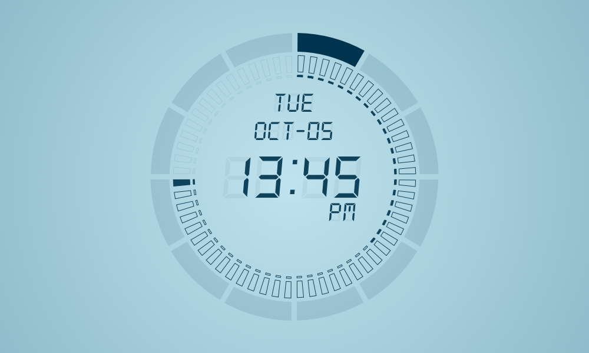

# aeyrium_clock

Aeyrium's submission for the #FlutterClock challenge.

The outer dial displays the time in a analog-like interface.  The thick outer band relfects the hour, the inner marks are minutes, and the smaller dashes on the inner most ring reflects the seconds.

The inner text display shows the time expressed in 12 adn 24 hours along with the day of week and the current month/date.

